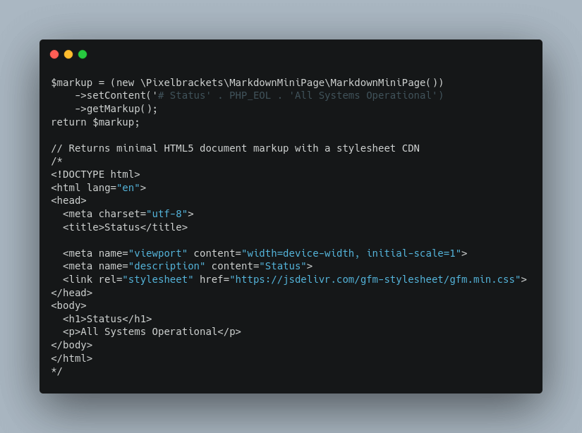

# Markdown Mini Page

[](https://packagist.org/packages/pixelbrackets/markdown-mini-page/)
[](https://gitlab.com/pixelbrackets/markdown-mini-page/pipelines)
[](https://gitlab.com/pixelbrackets/markdown-mini-page#requirements)
[](https://spdx.org/licenses/GPL-2.0-or-later.html)
[](https://gitlab.com/pixelbrackets/markdown-mini-page/-/blob/master/CONTRIBUTING.md)

Quickly convert Markdown into a valid HTML5 page with minimal styles.



_⭐ You like this package? Please star it or send a tweet. ⭐_

## Vision

This package converts Markdown content into HTML, wraps a HTML5 document header
and links a minimal stylesheet. This allows to quickly convert Markdown text
into a webpage view.

- Minimal implementation - Three lines of code are enough
  → 🤗 thanks to [pixelbrackets/html5-mini-template](https://packagist.org/packages/pixelbrackets/html5-mini-template)
- GitHub Flavored Markdown conversion
  → 🤗 thanks to [erusev/parsedown](https://packagist.org/packages/erusev/parsedown)
- GitHub Markdown stylesheet include
  → 🤗 thanks to [pixelbrackets/gfm-stylesheet](https://gitlab.com/pixelbrackets/gfm-stylesheet/)

See [»Usage«](#usage) for some examples.

The package follows the KISS principle.

## Requirements

- PHP

## Installation

Packagist Entry https://packagist.org/packages/pixelbrackets/markdown-mini-page/

## Source

https://gitlab.com/pixelbrackets/markdown-mini-page/

Mirror https://github.com/pixelbrackets/markdown-mini-page/ (Issues & Pull
Requests mirrored to GitLab)

## Demo

🚀 https://markdown-mini-page.app.pixelbrackets.de/

⌨️ [`php tests/demo.php`](./tests/demo.php).

## Usage

This package supports all options of the
[pixelbrackets/html5-mini-template](https://packagist.org/packages/pixelbrackets/html5-mini-template)
package. For example `setStylesheet()` to overwrite the default stylesheet.

1. Convert a message written in Markdown style into a HTML, wrap into a HTML5
   document and link a minimal stylesheet
   ```php
   $markup = (new \Pixelbrackets\MarkdownMiniPage\MarkdownMiniPage())
       ->setContent('Hello _Markdown_ World!')
       ->getMarkup();
   echo $markup;
   ```

1. Convert & wrap a message, set your own stylesheet URL and title
   ```php
   $template = (new \Pixelbrackets\MarkdownMiniPage\MarkdownMiniPage())
       ->setStylesheet('/assets/styles.css')
       ->setTitle('Index')
       ->setContent('# Status' . PHP_EOL . 'All Systems Operational');
   echo $template->getMarkup();
   ```

## License

GNU General Public License version 2 or later

The GNU General Public License can be found at http://www.gnu.org/copyleft/gpl.html.

## Author

Dan Untenzu (<mail@pixelbrackets.de> / [@pixelbrackets](https://pixelbrackets.de))

## Changelog

See [CHANGELOG.md](./CHANGELOG.md)

## Contribution

This script is Open Source, so please use, share, patch, extend or fork it.

[Contributions](./CONTRIBUTING.md) are welcome!

## Feedback

Please send some [feedback](https://pixelbrackets.de/) and share how this
package has proven useful to you or how you may help to improve it.
